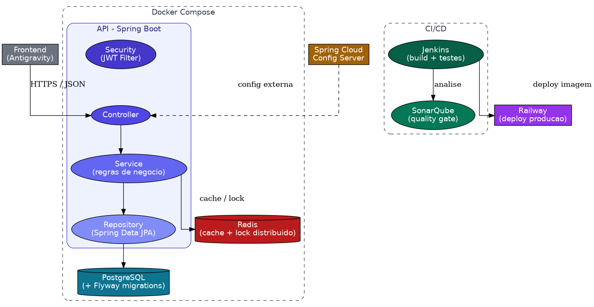
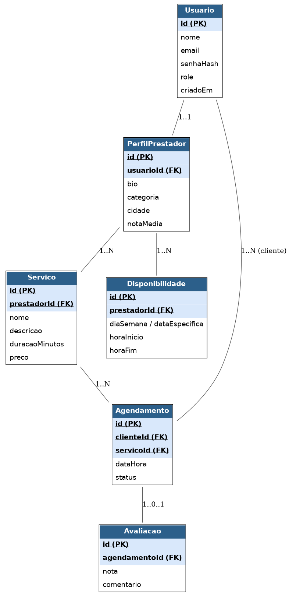

# Achou! 🔧

API REST para agendamento de serviços locais — clientes encontram prestadores (eletricista, diarista, manicure, etc.), consultam disponibilidade e agendam horários com segurança contra conflitos de agenda.

Projeto de portfólio construído pra demonstrar uma stack Spring Boot completa e orientada a produção: autenticação stateless com JWT, cache e lock distribuído com Redis, versionamento de schema com Flyway, containerização com Docker Compose, pipeline de qualidade com Jenkins + SonarQube e deploy contínuo no Railway.


---

## Índice

- [Sobre o projeto](#sobre-o-projeto)
- [Arquitetura](#arquitetura)
- [Modelo de dados](#modelo-de-dados)
- [Stack técnica](#stack-técnica)
- [Como rodar localmente](#como-rodar-localmente)
- [Endpoints principais](#endpoints-principais)
- [Testes](#testes)
- [Pipeline CI/CD](#pipeline-cicd)
- [Deploy](#deploy)
- [Estrutura do repositório](#estrutura-do-repositório)
- [Documentação completa](#documentação-completa)

## Sobre o projeto

O Achou! resolve um problema real: marcar um serviço local hoje é uma troca de mensagens manual, sem visibilidade de agenda e sujeita a conflito de horário. A API cobre o fluxo completo — cadastro, consulta de disponibilidade, agendamento, confirmação e avaliação — com as regras de negócio que isso exige (ex.: impedir dois agendamentos no mesmo horário do mesmo prestador).

Requisitos funcionais e não funcionais completos em [`docs/requisitos.md`](docs/requisitos.md).

## Arquitetura



- **Controller → Service → Repository**, camadas clássicas do Spring Boot.
- **Security (JWT)** protegendo rotas por papel (`CLIENTE`, `PRESTADOR`, `ADMIN`).
- **Redis** cacheando consultas de disponibilidade e garantindo lock distribuído na criação de agendamentos (evita condição de corrida entre dois clientes agendando o mesmo horário).
- **Spring Cloud Config** centralizando configuração por ambiente.
- **Docker Compose** subindo API + PostgreSQL + Redis com um comando.
- **Jenkins + SonarQube** validando qualidade antes de publicar.
- **Railway** hospedando a aplicação em produção.

## Modelo de dados



Entidades principais: `Usuario`, `PerfilPrestador`, `Servico`, `Disponibilidade`, `Agendamento`, `Avaliacao`. Schema versionado via Flyway em [`backend/src/main/resources/db/migration`](backend/src/main/resources/db/migration).

## Stack técnica

| Categoria | Tecnologia |
|---|---|
| Linguagem / Framework | Java 21, Spring Boot |
| Web / Validação | Spring Web, Bean Validation |
| Segurança | Spring Security, JWT |
| Persistência | Spring Data JPA, PostgreSQL, Flyway |
| Cache / Lock | Redis, Spring Data Redis |
| Configuração | Spring Cloud Config |
| Containerização | Docker, Spring Boot Docker Compose |
| Produtividade | Lombok, Spring DevTools |
| Testes | JUnit 5, Mockito, Testcontainers |
| Qualidade / CI | Jenkins, SonarQube |
| Deploy | Railway |
| Frontend | Gerado com Antigravity (pasta `frontend/`) |

## Como rodar localmente

Pré-requisitos: Docker e Docker Compose instalados.

```bash
git clone https://github.com/<seu-usuario>/achou-plataforma.git
cd achou-plataforma/backend
cp .env.example .env
docker compose up
```

A aplicação sobe em `http://localhost:8080`, já com PostgreSQL e Redis provisionados e as migrations do Flyway aplicadas automaticamente. Documentação interativa da API em `http://localhost:8080/swagger-ui.html`.

## Endpoints principais

| Método | Rota | Descrição | Autenticação |
|---|---|---|---|
| POST | `/auth/login` | Autentica e retorna JWT | Pública |
| POST | `/usuarios` | Cadastra Cliente ou Prestador | Pública |
| POST | `/servicos` | Cria um serviço | PRESTADOR |
| GET | `/servicos/{prestadorId}/disponibilidade` | Consulta horários livres | Autenticado |
| POST | `/agendamentos` | Cria um agendamento | CLIENTE |
| PATCH | `/agendamentos/{id}/cancelar` | Cancela um agendamento | CLIENTE |
| POST | `/agendamentos/{id}/avaliacao` | Avalia um atendimento concluído | CLIENTE |

Contrato completo em [`docs/api`](docs/api) (export OpenAPI/Swagger).

## Testes

```bash
cd backend
mvn test
```

Cobre regras de negócio críticas (conflito de horário, regra de avaliação) e fluxos de integração com Testcontainers (PostgreSQL + Redis reais em container, sem mocks de infraestrutura).

## Pipeline CI/CD

Cada push dispara o `Jenkinsfile`: build → testes → análise SonarQube → build da imagem Docker. O merge só é permitido se o Quality Gate do SonarQube passar.

## Deploy

Aplicação publicada no Railway, com PostgreSQL e Redis provisionados como addons e configuração de produção isolada via Spring Cloud Config.

## Estrutura do repositório

```
achou-plataforma/
├── backend/          # API Spring Boot
├── database/         # migrations de referência + diagrama ER
├── docs/             # requisitos, ADRs, contrato da API
├── diagramas/        # arquitetura e fluxos
└── frontend/         # gerado com Antigravity
```

## Documentação completa

- [Requisitos funcionais e não funcionais](docs/requisitos.md)
- [Decisões arquiteturais (ADRs)](docs/decisoes-arquiteturais)
- [Diagrama de arquitetura](diagramas/arquitetura.png)
- [Diagrama de entidades](database/er-diagram.png)
